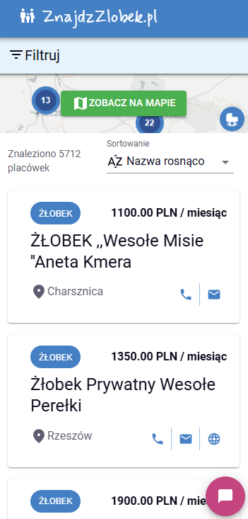
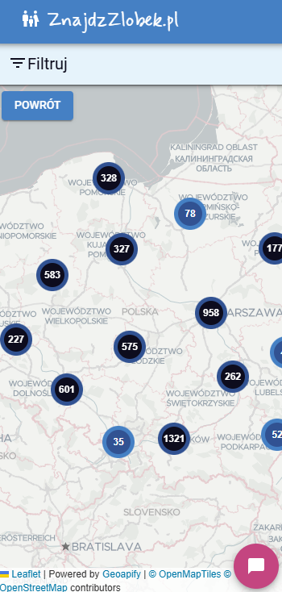

# Nursery-Nav

<p align="center">
    
</p>

[](https://github.com/kubawajs/nursery-nav/actions/workflows/frontend.yml)
[](https://github.com/kubawajs/nursery-nav/actions/workflows/backend.yml)

NurseryNav simplifies the search for nearby nursery schools by providing an easy-to-use map interface to help you find the perfect childcare option for your little ones.

**Live URL:** [https://znajdzzlobek.pl/](https://znajdzzlobek.pl/)

**Backend API DEMO:** [https://nursery-nav-api.vercel.app/](https://nursery-nav-api.vercel.app/api/)

---
This project is part of [100 commitow challenge](https://100commitow.pl/). It helps me learn front-end technologies like React, Typescript, and NestJS.

## Stack

### Frontend

* [React](https://react.dev/)
* [Typescript](https://www.typescriptlang.org/)
* [Vite](https://vite.dev/)
* [React Leaflet](https://react-leaflet.js.org/)
* [MUI](https://mui.com/material-ui/getting-started/)

### Backend

* [NestJS](https://nestjs.com/)

## Getting Started

### Prerequisites

* Node v20.18.0

### Frontend

#### Configuration

Add the `.env` file in the folder root with the keys:

```
VITE_APP_GEOAPIFY_API_KEY=
VITE_APP_API_URL=
VITE_APP_NAME=
VITE_APP_CONTACT_MAIL=
VITE_APP_GOOGLE_ANALYTICS_TRACKING_ID=
VITE_APP_DATA_SOURCE_UPDATE_DATE=
```

| Parameter                                 | Type   | Description                                                                                                                                                                        |
| ----------------------------------------- | ------ | ---------------------------------------------------------------------------------------------------------------------------------------------------------------------------------- |
| **VITE_APP_GEOAPIFY_API_KEY**             | string | Key to enable the map. Can be created here: [https://www.geoapify.com/get-started-with-maps-api#create-project](https://www.geoapify.com/get-started-with-maps-api#create-project) |
| **VITE_APP_API_URL**                      | string | URL to the API instance, e.g. on local it can be `http://localhost:3000`                                                                                                           |
| **VITE_APP_NAME**                         | string | The custom name of your application. It is displayed in the header and titles across the website                                                                                   |
| **VITE_APP_CONTACT_MAIL**                 | string | Email used in contact dialog on a map view                                                                                                                                         |
| **VITE_APP_GOOGLE_ANALYTICS_TRACKING_ID** | string | Google Analytics 4 tracking ID                                                                                                                                                     |
| **VITE_APP_DATA_SOURCE_UPDATE_DATE**      | date   | Last data update date, manually entered (displayed in tooltips)                                                                                                                    |

#### Running frontend

Go to `./src/nursery-nav` and run `npm run`.

### Backend

A static JSON file is provided as the backend API for the MVP version.
Check `./data/RZ-instytucje-enriched.json`

#### Configuration

Add the `.env` file in the folder root with the keys:

```
FRONTEND_URL=
CACHE_TTL=
THROTTLE_TTL=
THROTTLE_LIMIT=
MONGODB_URI=
```

| Parameter          | Type   | Description                                                                                                                                                                                                                        |
| ------------------ | ------ | ---------------------------------------------------------------------------------------------------------------------------------------------------------------------------------------------------------------------------------- |
| **FRONTEND_URL**   | string | Provide URL to your frontend instance, e.g. `http://localhost:3001` when running on local. This step is not required, but enables the frontend application origin to access the backend API - the app has CORS enabled by default. |
| **CACHE_TTL**      | number | Cache expiration TTL in milliseconds.                                                                                                                                                                                              |
| **THROTTLE_TTL**   | number | Throttle time limit in milliseconds.                                                                                                                                                                                               |
| **THROTTLE_LIMIT** | number | Calls limit within the TTL.                                                                                                                                                                                                        |
| **MONGODB_URI**    | string | Connection string to MongoDB database.                                                                                                                                                                                             |

#### Running backend
Go to `./src/nursery-nav-api` and run `npm run start:dev`.

#### API doc

Go to `/api` to display API Swagger doc:


## Project backlog

Project backlog is available in [Github Projects](https://github.com/users/kubawajs/projects/4)

## Features

### MVP ✅

#### Map view

| Desktop                                 | Mobile                                                                                        |
| --------------------------------------- | --------------------------------------------------------------------------------------------- |
|  |   |

#### Details view

| Desktop                                         | Mobile                                                |
| ----------------------------------------------- | ----------------------------------------------------- |
|  |  |

### Phase 1

#### Frontend

| Feature                                      | Status |
| -------------------------------------------- | ------ |
| Static data source                           | ✅      |
| Map                                          | ✅      |
| Pins on map                                  | ✅      |
| Institution details view                     | ✅      |
| Search                                       | ✅      |
| Display institution details on the pin click | ✅      |
| Basic component styling                      | ✅      |
| Group pins on the map                        | ✅      |
| SEO                                          | ✅      |
| Sorting                                      | ✅      |
| Filtering                                    | ✅      |
| Direct URLs to each institution              | ✅      |
| CICD                                         | ✅      |
| Live URL                                     | ✅      |

### Phase 2

* [x] Update docs

#### Frontend

| Feature                                         | Status |
| ----------------------------------------------- | ------ |
| Connection to the API                           | ✅      |
| Infinite scroll                                 | ✅      |
| Sorting with API                                | ✅      |
| Connect map with API                            | ✅      |
| Filtering with API                              | ✅      |
| Direct URLs to filtered results by query params | ✅      |
| Filtering map locations                         | ✅      |
| Autocomplete for institution name               | ✅      |
| Caching                                         | ✅      |
| About page                                      | ✅      |
| SEO improvements                                | ✅      |

#### API

| Feature                        | Status |
| ------------------------------ | ------ |
| API project                    | ✅      |
| Swagger `/api`                 | ✅      |
| GET all institutions           | ✅      |
| GET institution details        | ✅      |
| GET locations                  | ✅      |
| Sorting                        | ✅      |
| Autocomplete endpoint          | ✅      |
| Cities/voivodeships endpoint   | ✅      |
| Filtering                      | ✅      |
| Pagination                     | ✅      |
| CICD                           | ✅      |
| Live URL                       | ✅      |
| CORS                           | ✅      |
| Add real ID to the data source | ✅      |
| Data update with new file      | ✅      |

### Phase 3

* [x] Go-live
* [x] Update README

#### Frontend

| Feature                                              | Status |
| ---------------------------------------------------- | ------ |
| Add sitemap                                          | ✅      |
| Add Google Analytics                                 | ✅      |
| Comparison view                                      | ✅      |
| Select items to compare on the list view             | ✅      |
| Quick filters with cities                            | ✅      |
| Direct URLs to filtered cities and voivodeships      | ✅      |
| Feedback form v1 (report data error, suggest change) | ✅      |
| *About* page content                                 | ✅      |
| Display hour price when monthly not provided         | ✅      |
| Add 404 page                                         | ✅      |
| Add a map to mobile view                             | ✅      |

#### API

| Feature       | Status |
| ------------- | ------ |
| Rate limiting | ✅      |
| Helmet        | ✅      |

### [Plan] Phase 4

#### Frontend

* [ ] Institution profile
* [ ] Institution rating
* [x] Performance upgrades
* [x] Migrate to Vite

#### Backend

* [ ] Profile management
* [x] Convert data source to MongoDB
* [x] Performance upgrade

#### Admin

* [ ] Create Admin App
* [ ] Display institution list
* [ ] Display institution details
* [ ] Edit institution details
* [ ] Batch update institutions with file import
* [ ] Display update comparison

### Known bugs

* [x] The "Powrót" button on institution details does not remember the parameters of the previous page
* [x] City and voivodeship filters not selected based on query parameter
* [x] Price is not visible in mobile view when the "Brak wolnych miejsc" chip is displayed
* [x] City dropdown is not filtered based on voivodeship
* [x] Voivodeship is not automatically selected on city dropdown change
* [ ] If filters are selected on the list view, the map pin is not displayed on the details view when redirected from autocomplete
* [x] Map does not focus on the pin when visiting the institution details page from a direct link

## Data source

Static file `/data/RZ-instytucje.csv` + subfolders.

Original data source - [Rejestr Żłobków - lista instytucji - dane.gov.pl](https://dane.gov.pl/pl/dataset/2106,rejestr-zobkow-lista-instytucji).

License: [CC0 1.0](https://creativecommons.org/publicdomain/zero/1.0/legalcode.pl)
