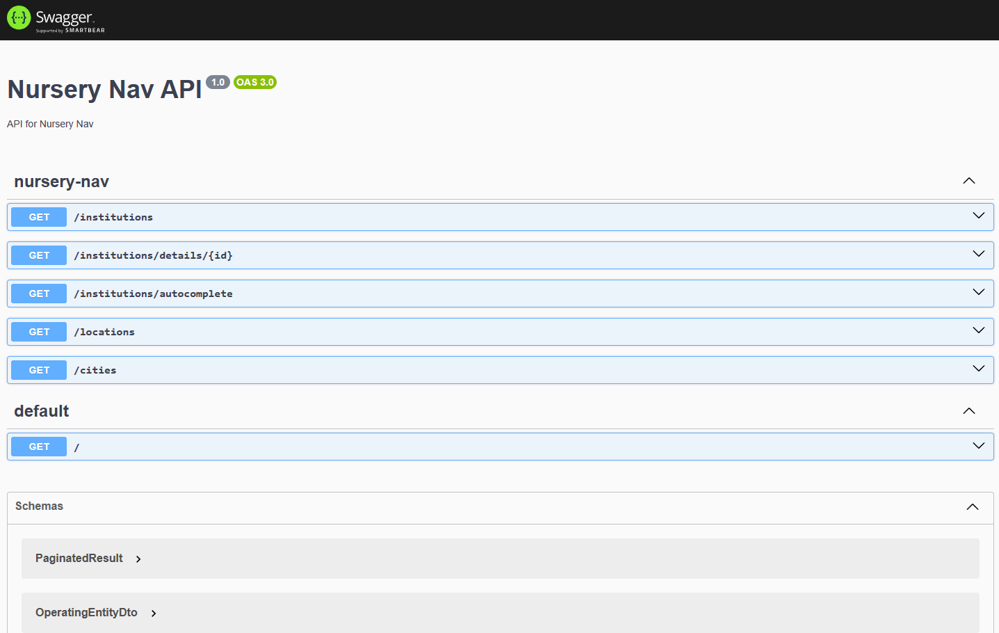

# Nursery-Nav

<p align="center">
    
</p>

[](https://github.com/kubawajs/nursery-nav/actions/workflows/frontend.yml)
[](https://github.com/kubawajs/nursery-nav/actions/workflows/backend.yml)

NurseryNav simplifies the search for nearby nursery schools by providing an easy-to-use map interface to help you find the perfect childcare option for your little ones.

**Live URL:** [https://nursery-nav.vercel.app/](https://nursery-nav.vercel.app/)

**Backend API DEMO:** [https://nursery-nav-api.vercel.app/](https://nursery-nav-api.vercel.app/api/)

---
This project is part of [100 commitow challenge](https://100commitow.pl/). It helps me learn front-end technologies like React, Typescript and NestJS.

## Stack

### Frontend

* [React](https://react.dev/)
* [Typescript](https://www.typescriptlang.org/)
* [React Leaflet](https://react-leaflet.js.org/)
* [MUI](https://mui.com/material-ui/getting-started/)

### Backend

* [NestJS](https://nestjs.com/)

## Getting Started

### Prerequisites

* Node v21.6.2

### Frontend

#### Configuration

Add `.env` file in the folder root with keys:

```
REACT_APP_GEOAPIFY_API_KEY=
REACT_APP_API_URL=
REACT_APP_NAME=
```

* REACT_APP_GEOAPIFY_API_KEY - key to enable the map. Can be created here: [https://www.geoapify.com/get-started-with-maps-api#create-project](https://www.geoapify.com/get-started-with-maps-api#create-project)
* REACT_APP_API_URL - URL to the API instance, e.g. on local it can be `http://localhost:3000`
* REACT_APP_NAME - custom name of your application. Is displayed in the header and in titles across the website

#### Running frontend

Go to `./src/nursery-nav` and run `npm run start`.

### Backend

A static JSON file is provided as the backend API for the MVP version.
Check `./data/RZ-instytucje-enriched.json`

#### Configuration

Add `.env` file in the folder root with keys:

```
FRONTEND_URL=
CACHE_TTL=3600000
```

* FRONTEND_URL - provide URL to your frontend instance, e.g. `http://localhost:3001` when running on local. This step is not required, but enables frontend application origin to access backend API - app has CORS enabled by default.
* CACHE_TTL - cache expiration TTL in miliseconds

#### Running backend
Go to `./src/nursery-nav-api` and run `npm run start:dev`.

#### API doc

Go to `/api` to display API Swagger doc:



## Features

### MVP ✅

#### Map view


#### Details view


#### Frontend

* [x] Static data source
* [x] Map
* [x] Pins on map
* [x] Institution details view
* [x] Search
* [x] Display institution details on pin click
* [x] Basic component styling
* [x] Group pins on the map
* [x] SEO
* [x] Sorting
* [x] Filtering
* [x] Direct URLs to each institution
* [x] CICD
* [x] Live URL

### Phase 2

* [x] Update docs

#### Frontend

* [x] Connection to the API
* [x] Infinite scroll
* [x] Sorting with API
* [x] Connect map with API
* [x] Filtering with API
* [x] Direct URLs to filtered results by query params
* [x] Filtering map locations
* [x] Autocomplete for institution name
* [x] Caching
* [x] About page
* [x] SEO

#### API

* [x] API project
* [x] Swagger `/api`
* [x] GET all institutions
* [x] GET institution details
* [x] GET locations
* [x] Sorting
* [x] Autocomplete endpoint
* [x] Cities/voivodeships endpoint
* [x] Filtering
* [x] Pagination
* [x] CICD
* [x] Live URL
* [x] CORS
* [x] Add real ID to the data source
* [x] Data update with new file

### Phase 3

* [ ] Go-live

#### Frontend

* [ ] Add sitemap
* [ ] Add Google Analytics
* [ ] Comparison view
* [ ] Institution profile
* [ ] Institution rating
* [ ] Performance upgrades
* [ ] Feedback form (report data error, suggest change)
* [ ] *About* page content
* [ ] Display day/hour price when monthly not provided

#### API

* [ ] Convert data source to MongoDB
* [ ] API key authentication
* [ ] CSV import
* [ ] Fully automate data update process

### Known bugs

* [x] "Back" button on institution details does not remember parameters of previous page
* [x] City and voivodeship filters not selected based on query parameter
* [x] Price is not visible in mobile view when "Brak wolnych miejsc" chip is displayed
* [ ] City dropdown is not filtered based on voivodeship
* [x] Voivodeship is not automatically selected on city dropdown change

## Data source

Static file `/data/RZ-instytucje.csv` + subfolders.

Original data source - [Rejestr Żłobków - lista instytucji - dane.gov.pl](https://dane.gov.pl/pl/dataset/2106,rejestr-zobkow-lista-instytucji/resource/56682,rejestr-zobkow-lista-instytucji/table).

License: [CC0 1.0](https://creativecommons.org/publicdomain/zero/1.0/legalcode.pl)